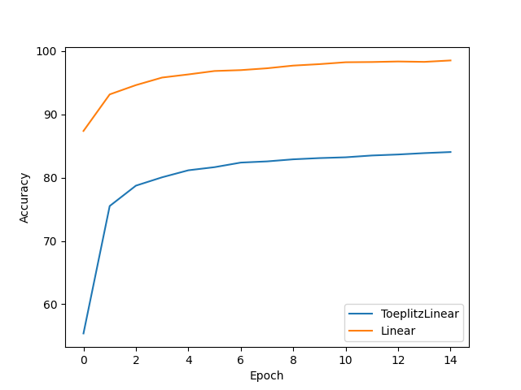
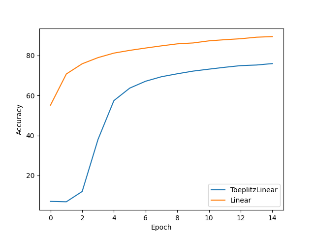

# Результаты экспериментов

Сравнение точности (accuracy) и потерь (loss) на различных датасетах

| Датасет       | Accuracy | Loss |
|--------------|----------|------|
| **CIFAR-10** |  |  |
| **EMNIST** |  |  |
| **Fashion MNIST** |  |  |
| **KMNIST** |  |  |
| **MNIST** |  |  |
| **STL-10** |  |  |
| **SVHN** |  |  |

## Анализ результатов

Очень плохо показали себя тёплицевы слои на **CIFAR-10** и **STL-10**. Их отличие от остальных заключается в том, что эти датасеты состоят из сложных фигур:
- Самолёты, автомобили, птицы и др. в случае **CIFAR-10**
- Коты, лошади, грузовики и др. в случае **STL-10**

Остальное - либо датасеты символов, либо чёрнобелой одежды с чёткими границами на изображениях.
Лучше всего, если смотреть на разницу между сетью с обычными слоями и Тёплицевыми, **SVHN**, **MNIST** и **Fashion MNIST**.

## Вывод

На приведённых графиках можно наблюдать, что написанные слои **ToeplitzLinear** работают хуже встроенных **nn.Linear**. Однако, если учитывать опыт автора в работе над написанием слоёв, можно считать, результат удовлетворительным, ведь потенциально **ToeplitzLinear** можно улучшить.

## Реализация слоя

```python
class ToeplitzLinear(nn.Module):
    def __init__(self, in_features, out_features):
        super().__init__()
        # Создание определяющего списка параметров
        self.diagonals = nn.Parameter(torch.empty(in_features + out_features - 1))
        self.in_features = in_features  # Длина входного вектора
        self.out_features = out_features  # Длина вектора на выходе
        idx_matrix = torch.LongTensor(
            [[i+j for j in range(in_features)] for i in range(out_features)]
        )  # Создание матрицы индексов
        self.reset_parameters()
        self.register_buffer("idx_matrix", idx_matrix)

    def reset_parameters(self):
        # Базовые параметры списка
        init.uniform_(self.diagonals, a=-1/10, b=1/10)


    def forward(self, x):
        # Воссоздаём матрицу
        W = self.diagonals[self.idx_matrix.to(x.device)]
        return x @ W.T
```